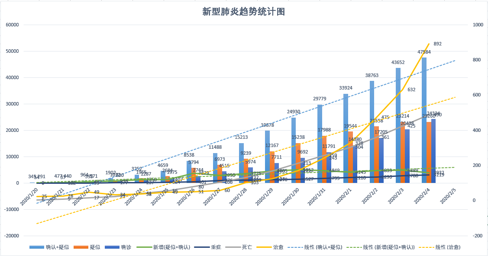

# 2019-nCoV

全国新型肺炎疫情每日数据动态趋势

数据来源：中华人民共和国国家卫生健康委员会 http://www.nhc.gov.cn/xcs/yqtb/list_gzbd.shtml

查看图表：[https://jackiezheng.github.io/2019-nCoV/web](https://jackiezheng.github.io/2019-nCoV/web)

# 相关链接：

### 数据

丁香园·丁香医生 提供实时全国数据 [https://3g.dxy.cn/newh5/view/pneumonia](https://3g.dxy.cn/newh5/view/pneumonia)

腾讯新闻 提供实时全国数据 [https://news.qq.com/zt2020/page/feiyan.htm](https://news.qq.com/zt2020/page/feiyan.htm)

新浪新闻 提供实时全国数据 [https://news.sina.cn/zt_d/yiqing0121](https://news.sina.cn/zt_d/yiqing0121)

北京日报 提供实时全国数据 [https://bjrbh5.bjd.com.cn/web/page](https://bjrbh5.bjd.com.cn/web/page)

### 工具

2019-nCoV 新型肺炎确诊患者相同行程查询工具 1.2 [http://2019ncov.nosugartech.com/](http://2019ncov.nosugartech.com)

新型冠状病毒感染的肺炎确诊患者同行程查询工具（人民网） v1.3 [https://h5.peopleapp.com/txcx/index.html](https://h5.peopleapp.com/txcx/index.html)

患者同程查询（搜狗） [https://sa.sogou.com/new-weball/page/sgs/epidemic/yyxw](https://sa.sogou.com/new-weball/page/sgs/epidemic/yyxw)

### 资料

新型冠状病毒肺炎预防指南 [https://mp.weixin.qq.com/s/95O_QKp2oxY2bHqucFfolw](https://mp.weixin.qq.com/s/95O_QKp2oxY2bHqucFfolw)

转扩！上班族返岗后如何防护？这份建议很重要！ [https://mp.weixin.qq.com/s/N5DmjCyAh5_f9m4zowV8nw](https://mp.weixin.qq.com/s/N5DmjCyAh5_f9m4zowV8nw)

# 各地及企业延迟复工：

