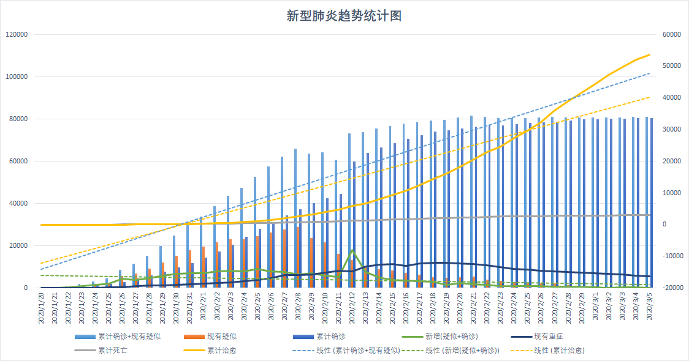
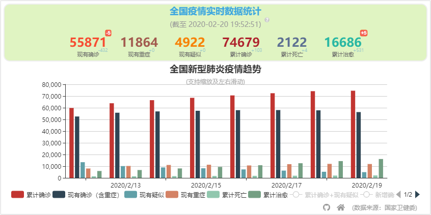
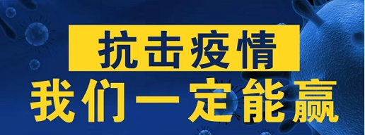

# 2019-nCoV(Covid-19)

全国新型冠状病毒肺炎（NCP）疫情每日数据动态趋势

> 新型冠状病毒肺炎（“Novel coronavirus pneumonia”，简称“NCP”），简称“新冠肺炎”，是指 2019 新型冠状病毒感染导致的肺炎。2019 年 12 月以来，湖北省武汉市部分医院陆续发现了多例有华南海鲜市场暴露史的不明原因肺炎病例，现已证实为 2019 新型冠状病毒感染引起的急性呼吸道传染病。[[信息来自百度百科]](https://baike.baidu.com/item/%E6%96%B0%E5%9E%8B%E5%86%A0%E7%8A%B6%E7%97%85%E6%AF%92%E8%82%BA%E7%82%8E/24282529)

> 在 2020 年 2 月 8 日下午举行的新闻发布会上，国家卫健委新闻发言人表示，将新型冠状病毒感染的肺炎暂命名为新型冠状病毒肺炎，简称新冠肺炎，英文简称为 NCP。[[信息来自百度百科]](https://baike.baidu.com/item/%E6%96%B0%E5%9E%8B%E5%86%A0%E7%8A%B6%E7%97%85%E6%AF%92%E8%82%BA%E7%82%8E/24282529)

> 【环球网快讯】全球研究与创新论坛 2 月 11 日在日内瓦开幕。世卫组织总干事谭德塞在记者会上宣布，将新型冠状病毒命名为“COVID-19”。[[环球网]](https://world.huanqiu.com/article/3wzeLjoJecj)

> 国家卫生健康委 2020-2-21 将“新型冠状病毒肺炎”英文名称修订为“COVID-19”，与世界卫生组织命名保持一致，中文名称保持不变。[[国家卫生健康委]](http://www.nhc.gov.cn/yzygj/s7653p/202002/33393aa53d984ccdb1053a52b6bef810.shtml)

数据来源：中华人民共和国国家卫生健康委员会 [http://www.nhc.gov.cn/xcs/yqtb/list_gzbd.shtml](http://www.nhc.gov.cn/xcs/yqtb/list_gzbd.shtml)

查看图表：[https://jackiezheng.github.io/2019-nCoV/web](https://jackiezheng.github.io/2019-nCoV/web)

## 相关链接

### 开源项目

武汉开源 [https://weileizeng.github.io/OpenSourceWuhan/](https://weileizeng.github.io/OpenSourceWuhan/)

2020 援助武汉 [https://github.com/wuhan2020](https://github.com/wuhan2020)

抗疫防疫项目大汇总 [https://gitee.com/dcloud/xinguan2020](https://gitee.com/dcloud/xinguan2020)

(Github)全国新型冠状肺炎疫情每日数据动态[https://github.com/JackieZheng/2019-nCoV](https://github.com/JackieZheng/2019-nCoV)

(Gitee)全国新型冠状肺炎疫情每日数据动态[https://gitee.com/JackieZheng/GitHub-2019-nCoV](https://gitee.com/JackieZheng/GitHub-2019-nCoV)

全国及各省新型肺炎疫情情况图(数据持续更新并开放接口) [https://github.com/hack-fang/nCov](https://github.com/hack-fang/nCov)

ncov web [https://github.com/pzhaonet/ncov](https://github.com/pzhaonet/ncov)

### 数据

丁香园·丁香医生 提供实时全国数据 [https://3g.dxy.cn/newh5/view/pneumonia](https://3g.dxy.cn/newh5/view/pneumonia)

腾讯新闻 提供实时全国数据 [https://news.qq.com/zt2020/page/feiyan.htm](https://news.qq.com/zt2020/page/feiyan.htm)

新浪新闻 提供实时全国数据 [https://news.sina.cn/zt_d/yiqing0121](https://news.sina.cn/zt_d/yiqing0121)

北京日报 提供实时全国数据 [https://bjrbh5.bjd.com.cn/web/page](https://bjrbh5.bjd.com.cn/web/page)

新华网新媒体 提供实时全国数据 [http://fms.news.cn/swf/2020_sjxw/2_1_xgyq/](http://fms.news.cn/swf/2020_sjxw/2_1_xgyq/)

### 工具

全国口罩预订信息共享平台--科普中国--人民网 [http://lxjk.people.cn/GB/404218/431655/431797/index.html](http://lxjk.people.cn/GB/404218/431655/431797/index.html)

2019-nCoV 新型肺炎确诊患者相同行程查询工具 1.2 [http://2019ncov.nosugartech.com/](http://2019ncov.nosugartech.com)

新型冠状病毒感染的肺炎确诊患者同行程查询工具（人民网） v1.3 [https://h5.peopleapp.com/txcx/index.html](https://h5.peopleapp.com/txcx/index.html)

患者同程查询（搜狗） [https://sa.sogou.com/new-weball/page/sgs/epidemic/yyxw](https://sa.sogou.com/new-weball/page/sgs/epidemic/yyxw)

身边疫情分布查询 [https://z.cbndata.com/2019-nCoV/](https://z.cbndata.com/2019-nCoV/)

周边疫情查询工具（腾讯）[https://ncov.html5.qq.com/communityRenmin](https://ncov.html5.qq.com/communityRenmin)

### 资料资讯

全国总工会： 企业应按正常标准向在家上班职工付工资 [http://www.acftu.org/template/10041/file.jsp?cid=222&aid=99904](http://www.acftu.org/template/10041/file.jsp?cid=222&aid=99904)

重磅！更严防控，北京再发通告！(2020-2-28) [https://mp.weixin.qq.com/s/3cHknEo7UOyF_bxqv1FU_g](https://mp.weixin.qq.com/s/3cHknEo7UOyF_bxqv1FU_g)

开学时间继续推迟！各地开学时间更新汇总(2020-2-28) [https://mp.weixin.qq.com/s/-Kwy4Tot15nwkHnovLC9cg](https://mp.weixin.qq.com/s/-Kwy4Tot15nwkHnovLC9cg)

​ 中央最新通知！​ 大中小学等开学时间原则上继续推迟(2020-2-27) [https://mp.weixin.qq.com/s/fZRUW3Kv5VuB2kMuXEqDgw](https://mp.weixin.qq.com/s/fZRUW3Kv5VuB2kMuXEqDgw)

《企事业单位复工复产疫情防控措施指南》 [https://mp.weixin.qq.com/s/RFETviol4fHyVEtjihHNiA](https://mp.weixin.qq.com/s/RFETviol4fHyVEtjihHNiA)

新型冠状病毒肺炎预防指南 [https://mp.weixin.qq.com/s/95O_QKp2oxY2bHqucFfolw](https://mp.weixin.qq.com/s/95O_QKp2oxY2bHqucFfolw)

转扩！上班族返岗后如何防护？这份建议很重要！ [https://mp.weixin.qq.com/s/N5DmjCyAh5_f9m4zowV8nw](https://mp.weixin.qq.com/s/N5DmjCyAh5_f9m4zowV8nw)

一图了解第六版诊疗方案要点 [https://mp.weixin.qq.com/s/qljsrxSjsj-Kl0sjV7Ay1Q](https://mp.weixin.qq.com/s/qljsrxSjsj-Kl0sjV7Ay1Q)

消毒剂的正确使用指南 [https://mp.weixin.qq.com/s/AOoJZv56m1fXjiCZ3kOQlQ](https://mp.weixin.qq.com/s/AOoJZv56m1fXjiCZ3kOQlQ)

### 学习资源

31 省市在线教育资源汇总来了！（PDF 版下载）[https://mp.weixin.qq.com/s/lqhjBJhowU35CBdJssO8NQ](https://mp.weixin.qq.com/s/lqhjBJhowU35CBdJssO8NQ)

国家中小学网络云平台[http://ykt.eduyun.cn/](http://ykt.eduyun.cn/)

电子课本：部编语文、人教版、苏教版、北师大版、沪教版语数英教材下册及预习资料

[https://mp.weixin.qq.com/s/3NHnm1vnzyJ5nibKQVjejQ](https://mp.weixin.qq.com/s/3NHnm1vnzyJ5nibKQVjejQ)

## 各地及企业延迟复工

[延迟复工再升级！这些企业不得于 3 月 16 日前复工！](http://t.cn/A6h5fmJF)

[最新消息！阿里宣布无限期延迟复工，字节跳动、腾讯......等企业也再次延迟！](https://mp.weixin.qq.com/s/f0aPm9pllw932CP4QED1zg)

## 全国各地开学时间一览表

开学时间继续推迟！各地开学时间更新汇总(2020-2-28) [https://mp.weixin.qq.com/s/-Kwy4Tot15nwkHnovLC9cg](https://mp.weixin.qq.com/s/-Kwy4Tot15nwkHnovLC9cg)
